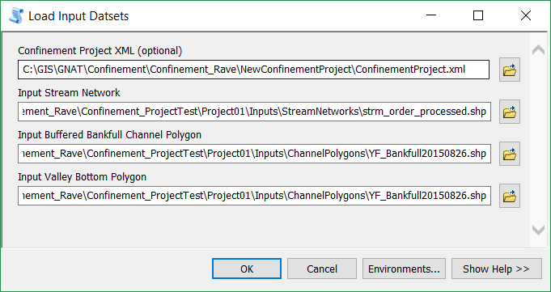

1. Create an empty folder on your system that will store the confinement project. Input datasets will be copied to this location through the project workflow

2. Open ArcMap and navigate to Confinement Toolbox / Confinement Project Management / Create a New Confinement Project in ArcToolbox.
	1. Specify the **Name** of the New Project.
	2. Specify the **location of the Folder** you created in step 1 .
	3. Specify the **User** name creating the Project
	4. Specify the Region of the data for the project. ***This is limited to CRB (Columbia River Basin) for now.***
	5. Specify the Watershed (Huc) of the project.
	6. Click OK to generate the new project XML file.

Do not manually add data to the project folder. You will do this as a tool supported process in the next step. 

## Load Input Datasets to Project

1. In order to generate confinement within a project, you must first load the three input files to the project.
2. In ArcMap navigate to Confinement Toolbox / Confinement Project Management /  Load Input Datasets in ArcToolbox.
	1. Specify the Project.xml file created in step 1.
	2. Specify the following three inputs to the project:
		* Stream Network
		* Channel/Bankfull Buffer Polygon
		* Valley Bottom Polygon
	> These inputs may be of any GIS vector format (as recognized by ArcGIS), however when they are imported into the project, they will stored as Shapefiles (.shp). This should not have any affect on the data other than limiting the field names to 10 characters. 	
	2. Click OK to import the inputs into the project.
	

3. The Project.xml file will be updated to include these inputs, and they will be stored appropriately in the Project folder structure.

** At this point in the project, do not move any files within the project folder. Doing so could cause the project to become corrupt. **	

