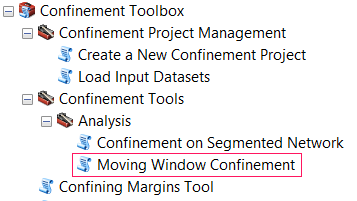
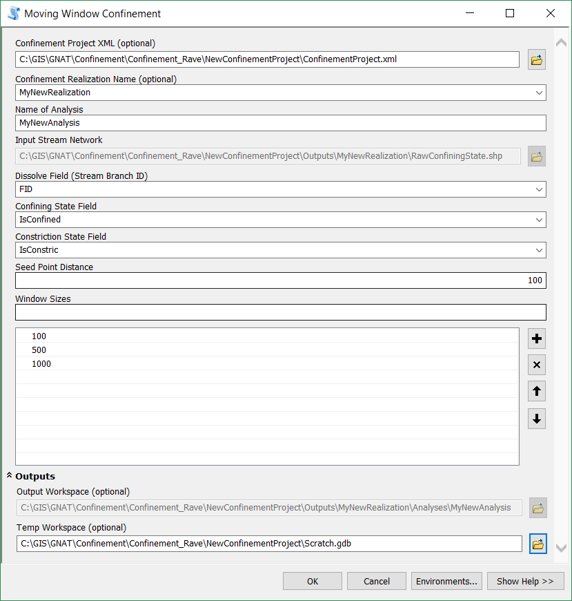

The moving window analysis tool calculates length based attributes over a series of user specified window lengths. The results are reported at the center point of each window series (Seed Point).

[TOC]

# Tool Usage

## Project Mode

Moving window results are stored as a "confinement analysis" and are associated with one and only one "Realization." If a new realization is created within a project, new analyses must be generated for the new realization. 

> **A Project will store all realizations and analyses. At this point, there is no support for deleting a realization or analysis from a project.**

1. Make sure you have generated at least one Confinement Realization.
2. In ArcMap navigate to Confinement Toolbox / Confinement Tools / Analysis / Moving Window Confinement Tool in ArcToolbox.
   1. Specify the **Project.XML** file. The Tool window will enter "Project Mode".
   2. From the Dropdown, select the Realization you want to base your analysis on.
      1. The Tool will automatically use the correct Stream Network Input from the specified Realization.
   3. Provide a unique name for the Moving window Analysis. The tool will check to make sure the name you provide does not already exist.
   4. Specify a **Dissolve** Field that is used to make continuous stretches of the stream. For Example, GNAT uses a "Stream Branch ID" system. 
   5. The tool will attempt to find the correct confinement and Constriction fields.
   6. Specify a seed Distance, 
   7. Specify the window size(s) you want to use.
   8. In "Project Mode", the output workspace is managed for you, 
   9. (Optional) Specify a Temporary workspace.  If one is not specified, the "in_memory" workspace will be used.
   10. Click OK to run the tool.

## Non Project Mode

1. Make sure you have run the Confining Margins tool.
2. In ArcMap navigate to Confinement Toolbox / Confinement Tools / Analysis / Moving Window Confinement Tool in ArcToolbox.
   1. Leave the **Project.XML** file and Realization parameters empty.
   2. Specify a **Dissolve** Field that is used to make continuous stretches of the stream. For Example, GNAT uses a "Stream Branch ID" system. 
   3. The tool will attempt to find the correct confinement and Constriction fields.
   4. Specify a seed Distance, 
   5. Specify the window size(s) you want to use.
   6. Specify the output workspace for the results.
   7. (Optional) specify a Temporary workspace. If one is not specified, the "in_memory" workspace will be used.
   8. Click OK to run the tool.

# About

## Methods

## Inputs ##

### Line Network

The Line network on which the Moving Window analysis will be generated. **This should be the `Raw Confining State` feature class output from the confinement tool.**

Requirements: 

* Contains the network attributes for which the moving window summary will be calculated (i.e. Confinement). 
* The Line Network must have tributary topology information as an attribute to dissolve the network (i.e. GNIS names, Stream Order, etc)

### Stream Route ID

The field that contains a unique ID for each Stream/Route. The tool will dissolve based on this ID, so as to create the longest continuous river segments for generating the Seed Points.

### Attribute Field

The Field that contains the Attribute information for the moving window calculation.

### Seed Point Distance

Distance between seed points. Seed Points represent the center of each window, and multiple windows are aligned on each seed point. The first seed point is located at half the distance of the largest window size from the ends of each stream route. This is to ensure that each seed point has every window size associated with it.

### Window Sizes

Window size (in meters) to be generated at each seed point.  Multiple window sizes can be specified.

### Output Workspace

Output File Geodatabase to store the results and intermediate data. The default is the Scratch Workspace listed in the File Geodatabase Environments.  

## Outputs ##

In the output workspace you will find:

### GNAT_MWA_SeedPoints

Points feature class that contain the calculated attribute for each window size, centered on each seed point feature. This layer contains the following attributes:

* `RouteID`: The same attribute as the `StreamBranchID` specified in the inputs.
* `SeedID`: Unique ID for each seed point. Can be used to join back to Window line features in GNAT_MWA_WindowLines.
* Each window size will have its own field (i.e. `WindowSize100` for a window of 100m, etc)

### GNAT_MWA_WindowLines

The line features that represent the moving windows. These features will overlap both in window spacing (seed distance) and window sizes. This layer contains the following attributes:

* `SeedID`: Unique id for each seed point. This can be used to join back to the individual seed points.
* `Window size`: Size of the window (due to geometric rounding, the actual shape length may be slightly larger or smaller than the window size).